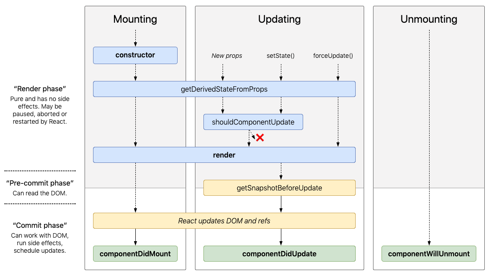

# Less Common Lifecycle Methods

The lifecycle methods covered in the main lecture should cover the vast majority of use cases. React does make several more available to you if your application is a bit more complicated. The full picture of lifecycle methods is shown here:

### [getDerivedStateFromProps()](https://reactjs.org/docs/react-component.html#static-getderivedstatefromprops)

Implement this method if you want to change how the state is generated, and make it dependent on changes in props. [It is rare that you would want to do this.](https://reactjs.org/blog/2018/06/07/you-probably-dont-need-derived-state.html)

### [shouldComponentUpdate()](https://reactjs.org/docs/react-component.html#shouldcomponentupdate)

This method is to be used only for performance optimization, and lets you skip updates if you know there is nothing to re-render. Using the built-in [PureComponent](https://reactjs.org/docs/react-api.html#reactpurecomponent) solves most of the problems that this lifestyle method attempts to address, and outside of a few specific applications, if you feel like you need to use it, it probably means that your app is not configured properly.

### [getSnapshotBeforeUpdate()](https://reactjs.org/docs/react-component.html#getsnapshotbeforeupdate)

This method is invoked right before the changes to the DOM are made. The most common reason to want to use this would be to handle scrolling down in a chat app if the new chat bubble will be off the screen.

# 6. Legacy lifecycle Methods

You may see references to the following lifecycle methods in older code:

- componentWillMount()
- componentWillUpdate()
- componentWillReceiveProps()

These have all been renamed:

- UNSAFE_componentWillMount()
- UNSAFE_componentWillUpdate()
- UNSAFE_componentWillReceiveProps()

Do not use these. They have been renamed with the `UNSAFE` prefix because using them leads to bugs and bad code. Consult the documentation if you need to maintain an application that uses them, and try to avoid following tutorials, blogs or resources that implement these methods.